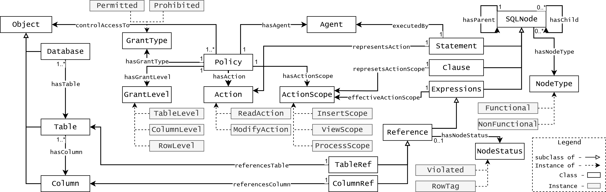

# Ontology

## High-level Introduction 

Inspired by Ontology-Based Access Control (OBAC) systems, this ontology provides a unified semantic representation across three distinct but interconnected domains: the database schema, access control policies, and the SQL Abstract Syntax Tree (AST). The structure is designed to transform a standard SQL query into an Abstract Semantic Graph (ASG), a rich, graph-based representation that enables formal, automated reasoning on the query's semantic properties and its compliance with security policies.

This ontology is organized into three conceptual "worlds" that work in concert:
- Schema World: A conceptual model of the relational database structure.
- Policy World: A formal definition of the access control rules.
- AST/Query World: A semantic representation of an incoming SQL query.

### Ontology Files 
- [Ontology](./ARGOS.rdf)
- [Finance Instance](./financial_instances.rdf)

## Ontology View 
The following diagram provides a high-level visualization of the ontology's structure, showing the key concepts within each world and the relationships that connect them.

### Schema World 
This world provides a conceptual abstraction of the RDB structure. To ensure that a single semantic policy is applied uniformly, semantically identical columns (e.g., a foreign key appearing in multiple tables) are modeled as a single ontological instance. In contrast, columns that merely share a name but have no key relationship are correctly instantiated as distinct entities. Finally, a "Row" is not modeled statically, as it is a dynamic concept defined by a query's conditional logic, which is handled in our policy domain.

### Policy World 
Our policy protocol is designed to provide granular control at multiple levels: by object (`GrantLevel`), by high-level operation (`hasAction`), and, most critically, by sub-operational scope (`hasActionScope`). This `ActionScope` attribute provides a deeper layer of semantic control, particularly for Read actions, for which we introduce two exclusive instances: `ViewActionScope` and `ProcessActionScope`.
- `ViewActionScope`: Corresponds to direct data exposure (e.g., in a `SELECT` clause).
- `ProcessActionScope`: Refers to the use of data in background computations (e.g., filtering in a `WHERE` clause).

This operational distinction, combined with other attributes like `GrantType` and `Condition` for dynamic `RowLevel` control, forms a highly expressive policy system.

### AST/SQL World
This domain's purpose is to lift a syntactic SQL AST into a semantic, graph-based representation upon which the reasoner can operate. It focuses on components relevant to access control rather than a complete, verbose taxonomy. The most critical function of this domain is to create `ColumnRef` and `TableRef` nodes. These reference nodes are the fundamental units of data interaction, as they explicitly declare which tables and columns the query intends to retrieve or process. By linking these nodes to their corresponding entities in the Schema World, we create the essential connection that bridges the gap between a dynamic query and the static policies.

## Usage of the Ontology
The ontology is the core component of a real-time framework that secures LLM-generated queries. The process is as follows:

1. Query Transformation: An incoming SQL query is parsed into a standard AST.
2. Semantic Lifting: This AST is then "lifted" into an instance of the ontology, creating the Abstract Semantic Graph (ASG). This step involves creating ColumnRef and TableRef instances in the Query World and linking them to their corresponding Column and Table instances in the Schema World.
3. Reasoning: The ASG, which now semantically represents the query and its relationship to the database schema and policies, is passed to the reasoner for validation.

## The Reasoner
The symbolic reasoner is the engine that enforces the access control logic defined in the ontology. Its primary function is to operate on the Abstract Semantic Graph (ASG) and perform logical inference.

By analyzing the connections between the Query, Schema, and Policy worlds within the ASG, the reasoner can:

- Assert Semantic Attributes: Automatically infer the semantic intent of different parts of the query (e.g., identifying that a SELECT clause has a ViewActionScope).

- Detect Violations: Formally check if any data reference in the query violates a policy assigned to the agent. For example, it can determine if a ColumnRef points to a Column that is prohibited by an active Policy.

- Guide Realignment: Provide the necessary information to a realignment module, which can then prune the violating parts of the query's AST before it is executed, ensuring security without outright rejecting the user's request.